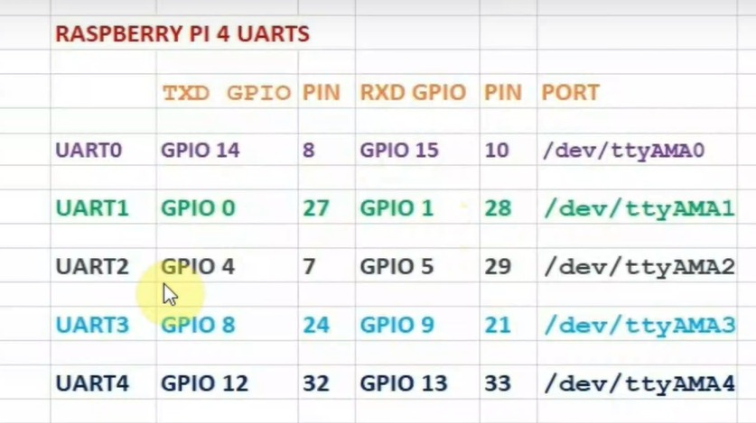

# Pinout das Portas UART



---

<br>

# Liberando mais portas UART no Raspberry Pi 4

## 1. Ativar UART principal

```bash
sudo raspi-config
```

Vá em: Interface Options → Serial Port

Escolha: Login shell: **No**

Escolha: Serial port hardware: **Yes**

---

## 2. Editar cmdline.txt

```bash
sudo nano /boot/firmware/cmdline.txt
```

Substitua **console=serial0** ou **console=ttyAMA0** por:

```bash
console=tty1
```

---

## 3. Editar config.txt

```bash
sudo nano /boot/firmware/config.txt
```

Adicione ao final do arquivo:

```conf
enable_uart=1
dtoverlay=disable-bt
dtoverlay=uart1
dtoverlay=uart2
dtoverlay=uart3
dtoverlay=uart4
dtoverlay=uart5
```
---

## 4. Reinicie o Raspberry Pi

```bash
sudo reboot
```

Após o reboot, as UARTs estarão disponíveis em **/dev/ttyAMA\*** ou **/dev/ttyS\***.